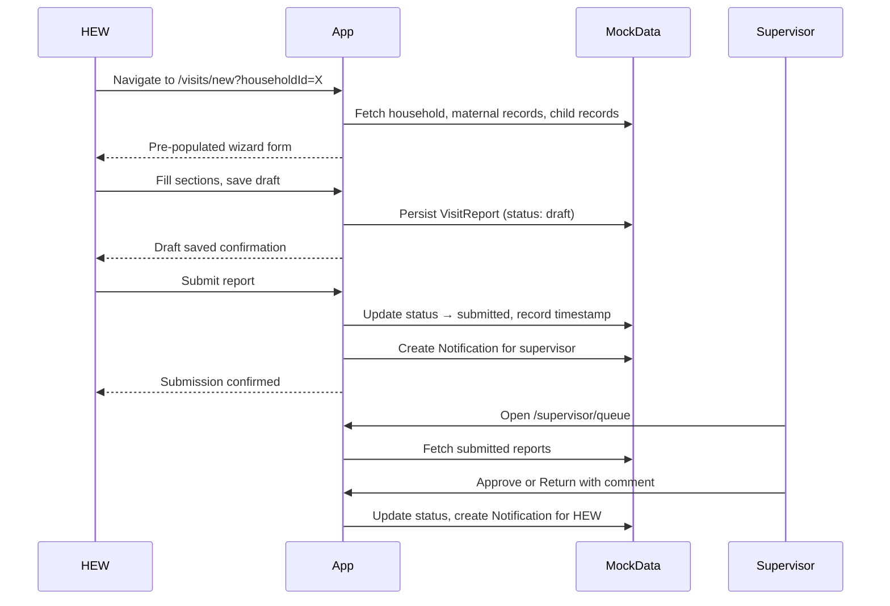
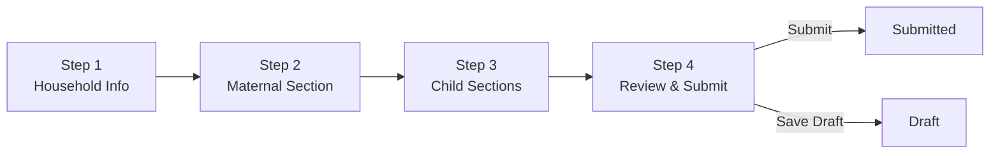

# Design Document: Household Visit Report

## Overview

The Household Visit Report feature digitizes the bi-weekly Appendix #1 Register used by Health Extension Workers (HEWs). The design extends the existing Next.js 16 / TypeScript / Tailwind CSS v4 app by adding new data types, four new route groups, a multi-step wizard form, a supervisor review queue, risk-based alert UI, and in-app notification integration — all using the established patterns (mock data layer, section-card layout, existing UI components).

The feature spans two user roles:
- **HEW (health_worker)**: creates, saves drafts, and submits visit reports
- **Supervisor**: reviews the queue, approves or returns reports with comments

---

## Architecture

### Route Structure

```
(app)/
  visits/
    page.tsx                  — HEW: list of all visit reports for their households
    new/
      page.tsx                — HEW: multi-step wizard (?householdId=X pre-populates)
    [id]/
      page.tsx                — HEW/Supervisor: read-only report view
  supervisor/
    queue/
      page.tsx                — Supervisor: review queue (Submitted reports)
```

Households detail page (`/households/[id]`) gains a Visit History tab showing all Visit_Reports for that household.

Maternal (`/maternal/[id]`) and Child (`/children/[id]`) detail pages gain a longitudinal summary panel.

### Data Flow



### Wizard Step Flow



---

## Components and Interfaces

### New Pages

| Route | Component | Purpose |
|---|---|---|
| `/visits` | `VisitsListPage` | HEW visit report list with status filters |
| `/visits/new` | `NewVisitPage` | Multi-step wizard form |
| `/visits/[id]` | `VisitDetailPage` | Read-only report view |
| `/supervisor/queue` | `SupervisorQueuePage` | Supervisor review queue |

### New UI Components

**`RiskFlagAlert`** (`src/components/ui/RiskFlagAlert.tsx`)
- Renders a prominent banner for high-priority flags (red) or medium (yellow)
- Props: `flags: RiskFlag[]`
- Displayed on wizard review step and on report detail view

**`VisitWizard`** (`src/components/visits/VisitWizard.tsx`)
- Orchestrates 4-step form
- Manages form state, draft auto-save (localStorage), step validation
- Sub-components:
  - `HouseholdInfoStep` — pre-populated household fields + program enrollment
  - `MaternalSectionStep` — maternal indicators, conditional fields (P/PN/L)
  - `ChildSectionStep` — child indicators, stimulation scores, milestone assessment
  - `ReviewSubmitStep` — read-only summary + risk flag display

**`VisitHistoryTable`** (`src/components/visits/VisitHistoryTable.tsx`)
- Reusable table for listing VisitReport rows
- Props: `reports: VisitReport[], onOpen: (id: string) => void`

**`LongitudinalSummary`** (`src/components/visits/LongitudinalSummary.tsx`)
- Renders a timeline/table of key indicators across approved visit reports
- Used in maternal and child detail pages

### Sidebar Navigation Updates

Add two new sidebar items:
- **Visits** (icon: `ClipboardList`) → `/visits` — visible to `health_worker`
- **Review Queue** (icon: `CheckSquare`) → `/supervisor/queue` — visible to `supervisor` and `admin`

### TopBar Updates

- Notification items sourced from `mockNotifications` (new mock array)
- Badge count driven by unread notification count
- "New" quick-add dropdown gains "New Visit Report" → `/visits/new`

---

## Data Models

### New Types (extend `src/types/index.ts`)

```typescript
export type VisitStatus = 'draft' | 'submitted' | 'approved' | 'returned';
export type RiskPriority = 'high' | 'medium';
export type YesNo = 'yes' | 'no';
export type YesNoNA = 'yes' | 'no' | 'na';
export type EarlyStimulationScore = 0 | 1 | 2;        // 0=Never, 1=Sometimes, 2=Yes
export type NutritionalStatus = 'sam' | 'mam' | 'n' | 'na';
export type MilestoneStatus = 'n' | 'sd' | 'dd';       // Normal, Suspected Delay, Developmental Delay
export type DisabilityCategory = 'md' | 'hd' | 'vd' | 'pd' | 'pp' | 'nd';
export type MaternalVisitStatus = 'p' | 'pn' | 'l';   // Pregnant, Postnatal, Lactating

export interface RiskFlag {
  type: 'sam' | 'mam' | 'depression' | 'violence' | 'child_violence' | 'developmental_delay';
  priority: RiskPriority;
  description: string;
  relatedRecordId: string;  // maternalRecordId or childRecordId
}

export interface MaternalVisitSection {
  maternalRecordId: string;
  maternalStatus: MaternalVisitStatus;
  // Read-only from record: name, age, deliveryDate (for PN)
  ancPncFollowUpStarted: YesNoNA;
  ancFollowUpDropped: YesNoNA;
  substanceUse: YesNo;
  substanceSpecification?: string;        // required if substanceUse === 'yes'
  signsOfDepression: YesNo;
  diverseDietExtraMeal: YesNo;
  ironFolicAcid: YesNoNA;
  partnerFamilySupport: YesNo;
  signsOfViolence: YesNo;
  // Only for pregnant (P):
  earlyStimulation?: {
    talkingSinging: YesNo;
    fetalMovementMonitoring: YesNo;
    bellyMassage: YesNo;
  };
  referred: YesNo;
  referralReasons?: Array<'anc' | 'pnc' | 'depression' | 'violence'>;
  nextAppointmentDate: string;
}

export interface ChildVisitSection {
  childRecordId: string;
  // Read-only from record: name, sex, dateOfBirth, caregiverName, caregiverSex, caregiverAge, caregiverPhone
  earlyStimulation: {
    talksSings: EarlyStimulationScore;
    plays: EarlyStimulationScore;
    tellsStoriesReads: EarlyStimulationScore;
    playsOutdoors: EarlyStimulationScore;
  };
  understandsChildNeeds: YesNo;
  positiveDiscipline: YesNo;
  vaccinationUpToDate: YesNoNA;
  feedingPractice: {
    exclusiveBreastfeeding: YesNo;
    complementaryFeeding: YesNo;
    balancedDiet: YesNo;
  };
  nutritionalStatus: NutritionalStatus;
  signsOfAbuseViolence: YesNo;
  abuseSpecification?: string;            // required if signsOfAbuseViolence === 'yes'
  hasToy: YesNo;
  toyType?: 'homemade' | 'purchased';
  referred: YesNo;
  referralReasons?: Array<'vitamin_a' | 'deworming' | 'malnutrition' | 'developmental_delay' | 'abuse_violence' | 'hospital' | 'other'>;
  referralOtherSpecification?: string;    // required if referralReasons includes 'other'
  nextAppointmentDate: string;
  // Milestone assessment (every 2 months):
  milestoneAssessment?: Record<string, MilestoneStatus>;
  disabilityCategories: DisabilityCategory[];
  riskFactorsForDevelopment: YesNo;
}

export interface VisitReport {
  id: string;
  householdId: string;
  visitNumber: number;
  visitDate: string;
  status: VisitStatus;
  // Household-level fields:
  vulnerabilityStatus: YesNo;
  psnpEnrollment: YesNo;
  cbhiStatus: 'free' | 'paid' | 'no';
  tdsStatus: YesNo;
  // Sections:
  maternalSection?: MaternalVisitSection;
  childSections: ChildVisitSection[];
  // Risk:
  riskFlags: RiskFlag[];
  // Workflow:
  hewId: string;
  submittedAt?: string;
  supervisorId?: string;
  approvedAt?: string;
  returnedAt?: string;
  supervisorComment?: string;
  // Meta:
  draftSavedAt?: string;
  createdAt: string;
  updatedAt: string;
}

export interface Notification {
  id: string;
  recipientUserId: string;
  type: 'submission' | 'approval' | 'returned' | 'risk_flag' | 'visit_reminder' | 'resubmit_reminder';
  title: string;
  message: string;
  relatedReportId?: string;
  isRead: boolean;
  isUrgent: boolean;
  createdAt: string;
}
```

### Mock Data Extensions (`src/lib/mockData.ts`)

Add:
- `mockVisitReports: VisitReport[]` — 5–8 sample reports covering all statuses
- `mockNotifications: Notification[]` — sample notifications for all event types
- Helper functions:
  - `getVisitReportsForHousehold(householdId: string): VisitReport[]`
  - `getNextVisitNumber(householdId: string): number`
  - `getSubmittedReportsForSupervisor(supervisorId: string): VisitReport[]`
  - `computeRiskFlags(maternal?: MaternalVisitSection, children?: ChildVisitSection[]): RiskFlag[]`

### Risk Flag Computation Logic

```typescript
function computeRiskFlags(
  maternal?: MaternalVisitSection,
  children: ChildVisitSection[] = []
): RiskFlag[] {
  const flags: RiskFlag[] = [];
  if (maternal?.signsOfDepression === 'yes')
    flags.push({ type: 'depression', priority: 'high', ... });
  if (maternal?.signsOfViolence === 'yes')
    flags.push({ type: 'violence', priority: 'high', ... });
  for (const child of children) {
    if (child.nutritionalStatus === 'sam')
      flags.push({ type: 'sam', priority: 'high', ... });
    if (child.nutritionalStatus === 'mam')
      flags.push({ type: 'mam', priority: 'medium', ... });
    if (child.signsOfAbuseViolence === 'yes')
      flags.push({ type: 'child_violence', priority: 'high', ... });
    for (const [milestone, status] of Object.entries(child.milestoneAssessment ?? {}))
      if (status === 'dd')
        flags.push({ type: 'developmental_delay', priority: 'medium', ... });
  }
  return flags;
}
```

---

## Error Handling

### Form Validation

Validation runs at two levels:

1. **Per-step validation** — on "Next" click, the current step's required fields are checked. Incomplete fields are highlighted with a red border and a summary message appears at the top of the step.

2. **Pre-submission validation** — the full report is re-validated before `status` changes to `submitted`. This catches any gaps introduced by navigating backwards.

Validation rules map directly to Requirement 4:
- All required `YesNoNA` / `YesNo` fields must be set (not `undefined`)
- `substanceSpecification` required when `substanceUse === 'yes'`
- `abuseSpecification` required when `signsOfAbuseViolence === 'yes'`
- At least one `referralReason` when `referred === 'yes'`
- `visitDate` must not be in the future
- `nextAppointmentDate` must be after `visitDate`

Error messages follow the format: `"[Section name] — [field label] is required"`.

### Status Transition Guards

| Current Status | Allowed Transitions | Who |
|---|---|---|
| `draft` | → `submitted` | HEW only |
| `submitted` | → `approved`, `returned` | Supervisor only |
| `returned` | → `submitted` | HEW only |
| `approved` | (terminal) | — |

Any attempt to edit a `submitted` or `approved` report by a HEW is blocked at the UI level (form rendered read-only) and would be rejected at the data layer.

### Auto-Save / Draft Recovery

- Draft state is persisted to `localStorage` under the key `draft_visit_<householdId>` on every field change (debounced 1 s).
- On page load for `/visits/new?householdId=X`, the app checks localStorage for an existing draft key. If found, a banner prompts the user to resume or discard.
- On successful submission, the localStorage draft key is cleared.

### Postnatal Reclassification

When the wizard loads a maternal record with `status === 'pn'` (postnatal) and days since delivery > 60, the system sets `maternalStatus` in the section to `'l'` and displays a dismissible yellow info banner: "This woman's postnatal period has exceeded 60 days — her status has been updated to Lactating."

---

## Testing Strategy

### Dual Testing Approach

Both unit tests and property-based tests are required. They are complementary:
- Unit tests cover specific examples, integration between components, and error conditions.
- Property-based tests verify universal invariants across randomly generated inputs.

### Unit Tests

Focus areas:
- `computeRiskFlags()`: specific input → expected flags (one test per risk trigger type)
- `getNextVisitNumber()`: households with 0 visits returns 1; households with N visits returns N+1
- Wizard validation logic: specific invalid forms → correct error messages
- Status transition guards: verify each illegal transition is blocked
- Postnatal reclassification: delivery date 61+ days ago triggers reclassification banner
- `LongitudinalSummary`: renders correct number of rows for given approved report set

### Property-Based Testing

Library: **fast-check** (TypeScript-native, works in Next.js/Jest/Vitest environments)

Configuration: minimum **100 runs** per property. Each property test is tagged with:
```
// Feature: household-visit-report, Property N: <property text>
```

Each correctness property below maps to exactly one property-based test.


## Correctness Properties

*A property is a characteristic or behavior that should hold true across all valid executions of a system — essentially, a formal statement about what the system should do. Properties serve as the bridge between human-readable specifications and machine-verifiable correctness guarantees.*

### Property 1: Visit Number Auto-Increment

*For any* household with N existing visit reports, calling `getNextVisitNumber(householdId)` should return N + 1. When N = 0, it returns 1.

**Validates: Requirements 1.3, 1.4**

---

### Property 2: Draft Save Bypasses Required-Field Validation

*For any* partially complete visit report (including one with no sections at all), saving it as a draft must succeed without returning validation errors.

**Validates: Requirements 5.1**

---

### Property 3: Draft Round-Trip Fidelity

*For any* visit report form state, serializing it to the draft store and then deserializing it must produce a value that is deep-equal to the original state.

**Validates: Requirements 5.3**

---

### Property 4: Referral Reason Required When Referred

*For any* maternal section or child section where `referred = 'yes'`, the validation function must reject the section if `referralReasons` is empty or undefined. When `referred = 'no'`, referral reasons are not required.

**Validates: Requirements 2.6, 3.12, 4.5**

---

### Property 5: Postnatal Reclassification After 60 Days

*For any* maternal record with `status = 'pn'` and `daysSinceDelivery > 60`, the `resolveMaternalVisitStatus` function must return `'l'` (Lactating). For `daysSinceDelivery <= 60`, it must return `'pn'`.

**Validates: Requirements 2.8**

---

### Property 6: Risk Flag Priority Assignment

*For any* combination of maternal section and child sections passed to `computeRiskFlags`:
- If any child has `nutritionalStatus = 'sam'`, a `high`-priority `sam` flag is present
- If any child has `nutritionalStatus = 'mam'`, a `medium`-priority `mam` flag is present
- If maternal section has `signsOfDepression = 'yes'`, a `high`-priority `depression` flag is present
- If maternal section has `signsOfViolence = 'yes'`, a `high`-priority `violence` flag is present
- If any child has `signsOfAbuseViolence = 'yes'`, a `high`-priority `child_violence` flag is present
- If any child milestone has status `'dd'`, a `medium`-priority `developmental_delay` flag is present

**Validates: Requirements 8.1, 8.2, 8.3, 8.4, 8.5, 8.6**

---

### Property 7: Submission Creates Supervisor Notification

*For any* submitted visit report, the notification store must contain at least one notification with `recipientUserId` matching the assigned supervisor and `type = 'submission'` referencing that report's ID.

**Validates: Requirements 6.3, 10.1**

---

### Property 8: Supervisor Queue Sorted by Submission Date

*For any* set of submitted visit reports belonging to a supervisor's HEWs, `getSubmittedReportsForSupervisor(supervisorId)` must return those reports sorted by `submittedAt` ascending.

**Validates: Requirements 7.1**

---

### Property 9: Submitted Report Is Read-Only for HEW

*For any* visit report with `status` in `['submitted', 'approved']`, the `canHewEdit(report, userId)` function must return `false` for the submitting HEW's user ID.

**Validates: Requirements 6.4, 9.3**

---

### Property 10: Approval Records Supervisor Metadata

*For any* visit report in `submitted` status, calling `approveReport(reportId, supervisorId)` must produce a report where `status = 'approved'`, `supervisorId` matches the input, and `approvedAt` is a valid ISO timestamp.

**Validates: Requirements 7.3**

---

### Property 11: Return Requires Non-Empty Comment

*For any* attempt to return a visit report with an empty or whitespace-only comment string, `returnReport(reportId, supervisorId, comment)` must return a validation error and not change the report's status.

**Validates: Requirements 7.4**

---

### Property 12: Return Creates HEW Notification

*For any* returned visit report, the notification store must contain a notification with `recipientUserId` matching the HEW who submitted it and `type = 'returned'`, with `message` containing the supervisor's comment.

**Validates: Requirements 7.5, 10.3**

---

### Property 13: Visit Date Must Not Be in the Future

*For any* visit report where `visitDate` is a date strictly after today, the validation function must reject the report with an error referencing the visit date field.

**Validates: Requirements 4.6**

---

### Property 14: Appointment Date Must Be After Visit Date

*For any* maternal section or child section where `nextAppointmentDate <= visitDate`, the validation function must return an error referencing the appointment date field.

**Validates: Requirements 4.7**

---

### Property 15: Visit History Ordered by Date Descending

*For any* household with multiple visit reports, `getVisitReportsForHousehold(householdId)` must return reports sorted by `visitDate` descending.

**Validates: Requirements 9.1**

---

### Property 16: Urgent Notification on High-Priority Flag Submission

*For any* submitted visit report that contains at least one `RiskFlag` with `priority = 'high'`, the notification store must contain an `isUrgent = true` notification for the supervisor in addition to the standard submission notification.

**Validates: Requirements 8.7, 10.4**

---

### Property 17: Longitudinal Maternal Summary Completeness

*For any* set of approved visit reports for a household with a maternal record, `getLongitudinalMaternalSummary(maternalRecordId)` must return exactly one row per approved report containing the correct values for `signsOfDepression`, `ironFolicAcid`, and `ancPncFollowUpStarted`.

**Validates: Requirements 9.4**

---

### Property 18: Longitudinal Child Summary Completeness

*For any* set of approved visit reports for a household with a child record, `getLongitudinalChildSummary(childRecordId)` must return exactly one row per approved report containing the correct `nutritionalStatus`, all four `earlyStimulation` scores, and any milestone assessment results for that visit.

**Validates: Requirements 9.5**

---

### Property 19: Visit Reminder Within Two Days

*For any* household whose next scheduled visit cycle falls within 2 days from today and has no visit report created for that cycle, `getPendingVisitReminders(hewId)` must include a reminder notification for the assigned HEW.

**Validates: Requirements 10.5**

---

### Property 20: Overdue Return Reminder After Three Days

*For any* visit report in `returned` status where `returnedAt` is more than 3 days ago and the report has not been resubmitted, `getOverdueReturnReminders()` must include reminder notifications for both the HEW and the supervisor.

**Validates: Requirements 10.6**

---

## Error Handling (continued)

### Notification Delivery Failures

Since notifications are in-app only (no external delivery), failed writes are retried immediately. If the notification cannot be persisted in the mock store, the operation is logged and the UI shows a non-blocking toast: "Notification could not be sent. Please refresh."

### Concurrent Draft Edits

If a HEW has the same draft open in two tabs, the last write wins. A `updatedAt` timestamp check prevents stale overwrites: if the localStorage timestamp is newer than the in-memory state, the user is prompted to reload.

### Missing Linked Records

If a maternal or child record linked to a section is no longer found (e.g., deleted), the section renders a warning banner: "Linked record not found. This section cannot be submitted." The report can still be saved as a draft.

---

## Testing Strategy (continued)

### Unit Test Examples

```typescript
// computeRiskFlags — SAM triggers high flag
expect(computeRiskFlags(undefined, [{ nutritionalStatus: 'sam', ... }]))
  .toContainEqual({ type: 'sam', priority: 'high' });

// getNextVisitNumber — empty household returns 1
expect(getNextVisitNumber('hh-new')).toBe(1);

// returnReport — empty comment rejected
expect(() => returnReport('r1', 'sup1', '')).toThrow('Comment required');

// canHewEdit — submitted report returns false
expect(canHewEdit({ status: 'submitted' }, 'hew1')).toBe(false);
```

### Property-Based Test Sketch (fast-check)

```typescript
import fc from 'fast-check';

// Feature: household-visit-report, Property 6: computeRiskFlags assigns correct priority
test('SAM child always produces high-priority flag', () => {
  fc.assert(fc.property(
    fc.record({ nutritionalStatus: fc.constant('sam') }),
    (child) => {
      const flags = computeRiskFlags(undefined, [child]);
      return flags.some(f => f.type === 'sam' && f.priority === 'high');
    }
  ), { numRuns: 100 });
});

// Feature: household-visit-report, Property 3: draft round-trip fidelity
test('draft serialization is a round trip', () => {
  fc.assert(fc.property(
    arbitraryVisitFormState(),
    (state) => {
      const key = `draft_visit_${state.householdId}`;
      saveDraft(key, state);
      const loaded = loadDraft(key);
      return deepEqual(state, loaded);
    }
  ), { numRuns: 100 });
});
```

### Test Coverage Targets

| Layer | Approach | Target |
|---|---|---|
| `computeRiskFlags` | Property-based (P6) | All 6 trigger conditions × 100 runs |
| `validateReport` | Property-based (P4, P13, P14) | 100 runs each |
| Status transitions | Unit + property (P9, P10, P11) | All 4 statuses × allowed/blocked |
| Draft round-trip | Property-based (P3) | 100 runs |
| Notification creation | Property-based (P7, P12, P16) | 100 runs each |
| Visit history sort | Property-based (P15) | 100 runs |
| Longitudinal summaries | Property-based (P17, P18) | 100 runs |
